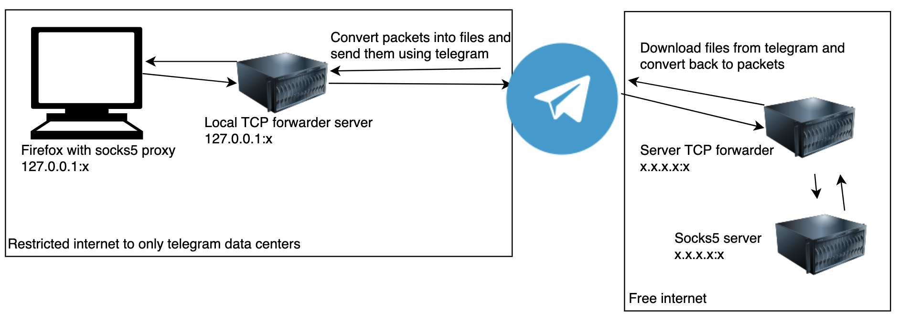

# SOCKS5 over telegram
---
### Description:
Used to bypass restricted networks that allow only social networks (cruise ships network, ...). 

### How to:

1) Start socks server on a server with free internet.
```
# PORT: The socks5 server port.
# USERNAME: The socks5 auth username.
# PASSWORD: The socks5 auth password.

php src/socks-server.php 127.0.0.1:PORT USERNAME:PASSWORD
```
2) Start local to telegram server on current pc:
```
# PORT: Port for the local tunnel to telegram.
# @channel: The telegram channel to send traffic to.

php src/local_to_telegram.php.php 127.0.0.1:PORT @channel
```
3) Start the telegram to socks server on the external server:
```
# SOCKS: The socks5 server IP.
# PORT: The socks5 server PORT.
# @channel: The telegram channel to send traffic to.

php src/telegram_to_socks.php.php SOCKS:PORT @channel
```
4) Test it:
```
# PORT: The local to telegram server port.

curl --socks5-hostname USERNAME:PASSWORD@127.0.0.1:PORT ifconfig.co
```

! NOTE: You must use two telegram bots within the same channel

If you run forward scripts for the first time you will be asked to log in, you have to insert an API id and API hash generated by telegram and log in as bot with the BotFather API token.

### Todo:
- Fix big requests
- Demo

### Status:
- Socks server ✅
- TCP Forwarder ✅
- Telegram comunication ✅
- Project working with minor bugs ✅

### Concept:
